# Aurora Report Tutorial

A hands-on tour for people who are new to Aurora Report — and new to test reports in general. You'll run a demo test suite that fails on purpose, then use the report to work out *why* it failed.

**Time:** about 30 minutes · **You need:** [Node.js](https://nodejs.org) 18+ and this repository.

> 📄 **Prefer to print or read offline?** [Download the PDF](Aurora-Report-Tutorial.pdf) — the same tutorial, 30 pages, with the answers to the exercises shown.
>
> Looking for the full reference instead? See [GUIDE.md](GUIDE.md).

---

## Contents

- [Part 0 — The big picture](#part-0--the-big-picture)
- [Part 1 — Run the demo](#part-1--run-the-demo)
- [Part 2 — Tour of the report](#part-2--tour-of-the-report)
- [Part 3 — Investigate your first failure](#part-3--investigate-your-first-failure)
- [Part 4 — The flaky test](#part-4--the-flaky-test)
- [Part 5 — A passing test that hides errors](#part-5--a-passing-test-that-hides-errors)
- [Part 6 — Watch the test instead of reading it](#part-6--watch-the-test-instead-of-reading-it)
- [Part 7 — The timeline](#part-7--the-timeline)
- [Part 8 — Make your own test tell a story](#part-8--make-your-own-test-tell-a-story)
- [Part 9 — Use it on your own project](#part-9--use-it-on-your-own-project)
- [Glossary](#glossary)

---

## Part 0 — The big picture

Three tools with three jobs:

| Tool | Job |
|---|---|
| **Playwright** | Opens a real browser and runs your tests |
| **Aurora Report** | Watches that run and records what happened |
| **The report** | An HTML page you open in your browser to see the results |

Here's the whole flow:

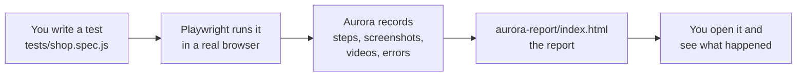
```mermaid
flowchart LR
    A["You write a test<br/>tests/shop.spec.js"] --> B["Playwright runs it<br/>in a real browser"]
    B --> C["Aurora records<br/>steps, screenshots,<br/>videos, errors"]
    C --> D["aurora-report/index.html<br/>the report"]
    D --> E["You open it and<br/>see what happened"]
```

**Why not just read the terminal?** The terminal tells you *a test failed*. The report shows you *what the page looked like when it failed*, *what the test did just before*, and *whether this is new*.

### What Aurora records during a single test

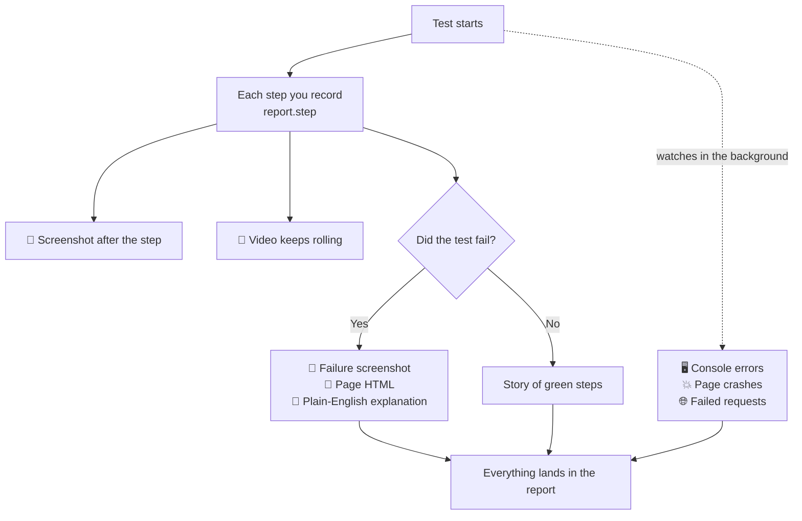
```mermaid
flowchart TD
    S["Test starts"] --> T["Each step you record<br/>report.step"]
    T --> U["📸 Screenshot after the step"]
    T --> V["🎥 Video keeps rolling"]
    S -.watches in the background.-> W["🖥 Console errors<br/>💥 Page crashes<br/>🌐 Failed requests"]
    T --> X{"Did the test fail?"}
    X -->|"Yes"| Y["📸 Failure screenshot<br/>🧾 Page HTML<br/>📝 Plain-English explanation"]
    X -->|"No"| Z["Story of green steps"]
    Y --> R["Everything lands in the report"]
    Z --> R
    W --> R
```

The parts marked *"watches in the background"* need no code at all. You get them just by using Aurora.

---

## Part 1 — Run the demo

This repository contains a small pretend shop (`demo-app/`) and tests for it (`tests/shop.spec.js`). Some tests fail **on purpose**, so the report has something interesting to show.

### The easy way (Windows)

Double-click **`start-demo.bat`**. It installs what's needed, runs the tests, and opens the report.

### The manual way (any OS)

```bash
npm install
npx playwright install chromium
npx playwright test
```

You'll see this at the end:

```
  4 failed
  2 flaky
  2 skipped
  10 passed (13.9s)

  ✨ Aurora report  10 passed · 4 failed · 2 flaky · 2 skipped
     file:///C:/.../aurora-report/index.html
```

> **"My tests failed!"** That's expected here. The demo has deliberate bugs so you have something to investigate. On CI, `npx playwright test` exiting with code 1 means *some tests failed*.

Open the report:

```bash
npx aurora-report open
```

### What just got created

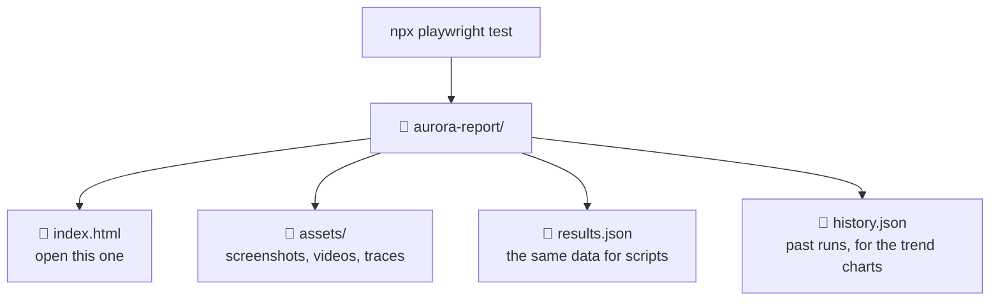
```mermaid
flowchart TD
    R["npx playwright test"] --> D["📁 aurora-report/"]
    D --> I["📄 index.html<br/>open this one"]
    D --> A["📁 assets/<br/>screenshots, videos, traces"]
    D --> J["📄 results.json<br/>the same data for scripts"]
    D --> H["📄 history.json<br/>past runs, for the trend charts"]
```

Only `index.html` matters for this tutorial. Keep the whole folder together, because the page loads screenshots from `assets/`.

---

## Part 2 — Tour of the report

The report has four pages. This is the map:

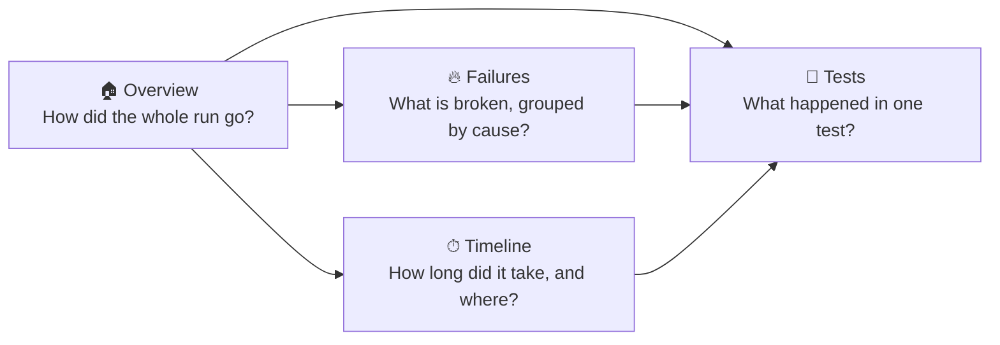
```mermaid
flowchart LR
    O["🏠 Overview<br/>How did the whole run go?"] --> T["🧪 Tests<br/>What happened in one test?"]
    O --> F["🔥 Failures<br/>What is broken, grouped by cause?"]
    O --> L["⏱ Timeline<br/>How long did it take, and where?"]
    F --> T
    L --> T
```

Press `1`, `2`, `3`, `4` to switch pages.

### The headline

The top of the Overview says what happened in plain English — no chart reading required.

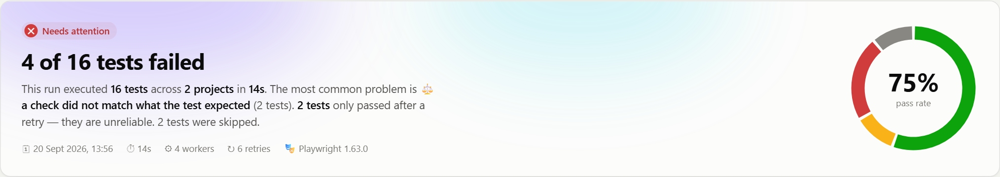

Read it out loud: *4 of 16 tests failed… the most common problem is a check did not match what the test expected… 2 tests only passed after a retry.* That's the entire run in three sentences. The ring on the right is the pass rate.

### The number tiles

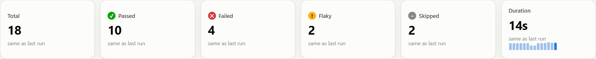

Each tile compares this run with the previous one, so ▲ or ▼ tells you whether things got better or worse. **Click a tile** to jump to those tests.

- **Failed** — the test did not pass, even after retries.
- **Flaky** — it failed, then passed when retried. Nothing is broken for the user, but the test can't be trusted.
- **Skipped** — the test was deliberately not run.

### What needs your attention

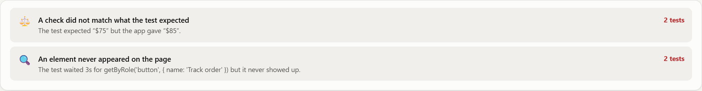

Aurora groups failures by **cause**, not by test. If 12 tests fail because one button was renamed, you see one row, not twelve. Start at the top.

### The charts

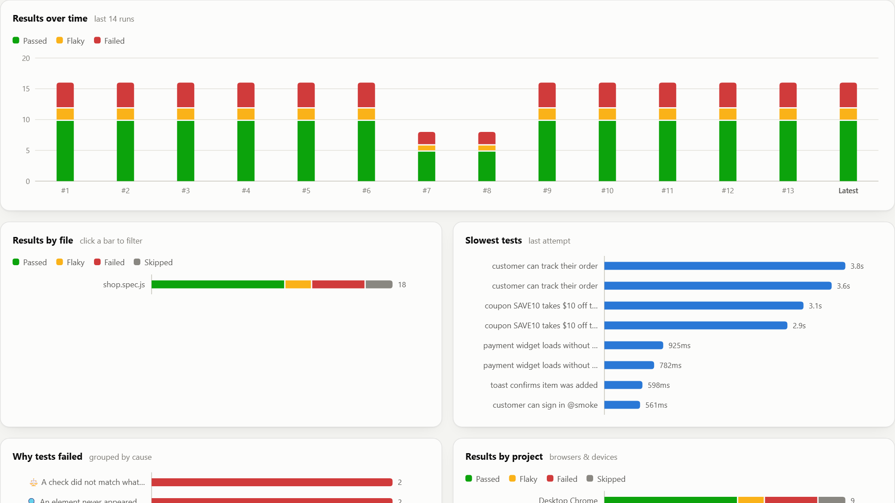

- **Results over time** — each bar is one run. Growing red means things are getting worse.
- **Results by file** — which spec file is unhealthy.
- **Slowest tests** — where your run time goes.
- **Why tests failed** — failure causes, largest first.

### Finding one test

Press `2` for the Tests page. The list on the left is how you find anything:

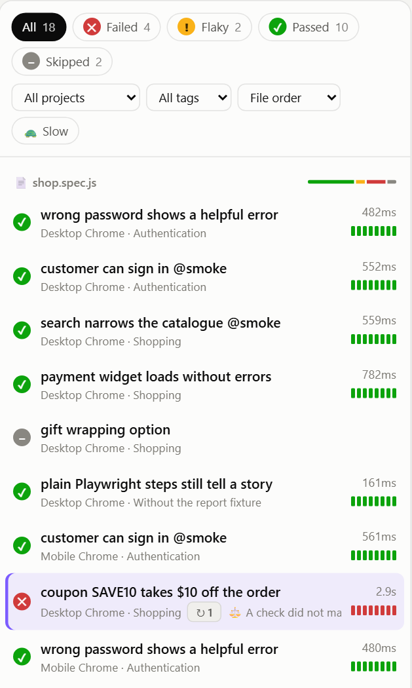

- **Status chips** — show only failed, flaky, passed or skipped tests.
- **Dropdowns** — filter by project (browser), by tag such as `@smoke`, or re-sort.
- **The little coloured bars** on the right of each row are that test's recent runs: green passed, red failed, amber flaky. A row of green with one red at the end means it just broke.

> **Exercise 1.** Look at your own report. How many tests ran, and what is the single most common failure cause?
>
> <details><summary>Answer for the demo</summary>16 tests ran (18 including skipped). The most common cause is "A check did not match what the test expected" — 2 tests.</details>

---

## Part 3 — Investigate your first failure

Here's the routine to follow whenever something is red:

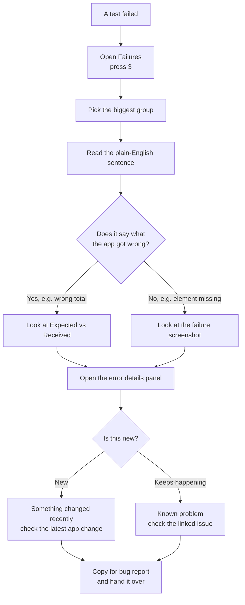
```mermaid
flowchart TD
    A["A test failed"] --> B["Open Failures<br/>press 3"]
    B --> C["Pick the biggest group"]
    C --> D["Read the plain-English sentence"]
    D --> E{"Does it say what<br/>the app got wrong?"}
    E -->|"Yes, e.g. wrong total"| F["Look at Expected vs Received"]
    E -->|"No, e.g. element missing"| G["Look at the failure screenshot"]
    F --> H["Open the error details panel"]
    G --> H
    H --> I{"Is this new?"}
    I -->|"New"| J["Something changed recently<br/>check the latest app change"]
    I -->|"Keeps happening"| K["Known problem<br/>check the linked issue"]
    J --> L["Copy for bug report<br/>and hand it over"]
    K --> L
```

Let's do it with the demo.

### Step 1 — Open the Failures page

Press `3`. The first group looks like this:

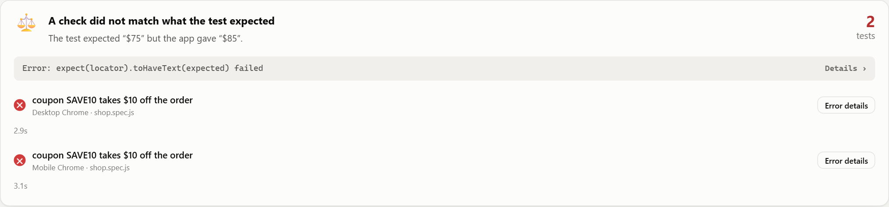

It tells you:
- **What went wrong:** the test expected `$75` but the app gave `$85`
- **How many tests:** 2 — the same test on two browsers
- Two ways in: **Details ›** for the cause, or a test name to open that test

### Step 2 — Open the test

Click **coupon SAVE10 takes $10 off the order · Desktop Chrome**.

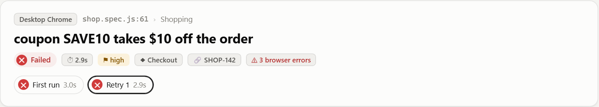

The header shows the status, how long it took, the severity and owner you set in the test, the linked issue, and the retry tabs — **First run** and **Retry 1**, because Playwright retried it once.

### Step 3 — Read "Why it failed"

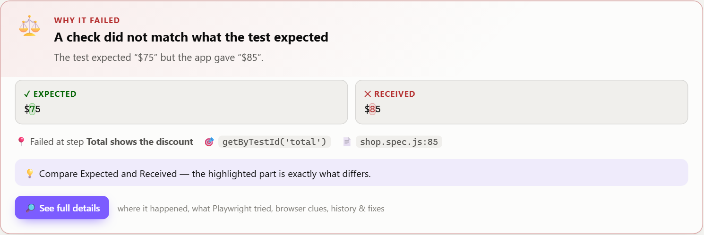

This is the important part, and it's four lines:

1. **The headline** — *A check did not match what the test expected.*
2. **Expected vs Received** — `$75` versus `$85`, with the difference highlighted. The coupon wasn't applied.
3. **Where** — it failed at the step *"Total shows the discount"*, on the element `getByTestId('total')`, at `shop.spec.js:85`.
4. **One tip** on what to do next.

You already know enough to file a bug: **the SAVE10 coupon does not reduce the total.**

### Step 4 — Get the full picture

Click **🔎 See full details** (or click any error anywhere in the report). A panel slides in:

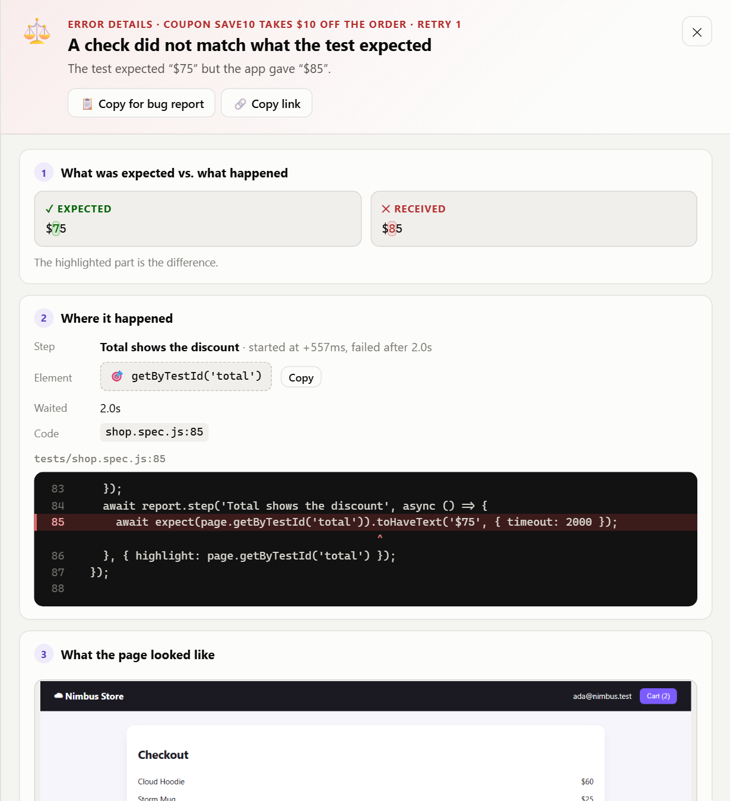

It answers the questions you'd ask next, in order:

| Section | Answers |
|---|---|
| 1. Expected vs. what happened | What exactly differed |
| 2. Where it happened | Which step, which element, which line of code |
| 3. What the page looked like | The screenshot at the moment of failure |
| 4. What the test did just before | The steps leading up to it |
| 5. What Playwright tried | Its internal log, rewritten in plain words |
| 6. Clues from the browser | Console errors, crashes, failed requests |
| 7. Is this new? | History, retries, and other tests with the same cause |
| 8. How to fix it | Suggestions for this kind of failure |

Scroll to section 4 — the steps just before the failure:

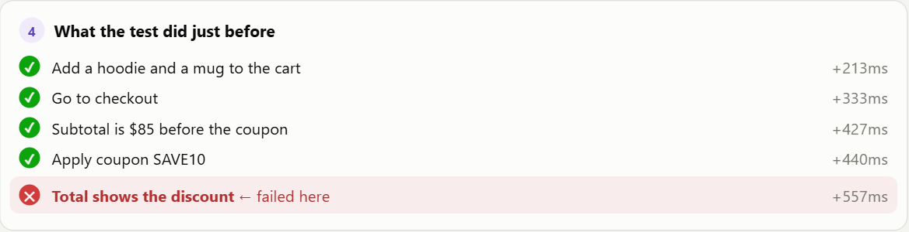

And section 7 — whether this is new:

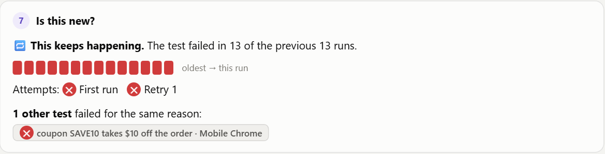

*"This keeps happening. The test failed in 8 of the previous 8 runs."* So this isn't a fresh regression — it's a known broken feature. If it said **🆕 This is new**, you'd go look at what changed in the app recently.

### Step 5 — Hand it over

Click **📋 Copy for bug report**. You get a ready-to-paste summary:

```markdown
**Test:** coupon SAVE10 takes $10 off the order (Desktop Chrome)
**File:** tests/shop.spec.js:61
**Problem:** A check did not match what the test expected. The test expected “$75” but the app gave “$85”.
**Failed step:** Total shows the discount
**Expected:** $75
**Received:** $85
**Element:** `getByTestId('total')`
```

Use **🔗 Copy link** to send a teammate a link that opens the report on this exact error.

> **Exercise 2.** Investigate the other failing test, *customer can track their order*. What's different about this failure, and what does the screenshot tell you?
>
> <details><summary>Answer</summary>It's a missing element, not a wrong value: <em>"The test waited 3s for getByRole('button', { name: 'Track order' }) but it never showed up."</em> The failure screenshot shows the shop page with no Track order button anywhere — the feature doesn't exist yet, so the test, not the app, is wrong.</details>

---

## Part 4 — The flaky test

A flaky test is one that fails, then passes when run again. Nothing is broken for the user — but you can't trust the test.

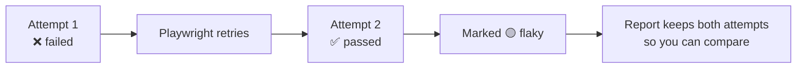
```mermaid
flowchart LR
    A["Attempt 1<br/>❌ failed"] --> B["Playwright retries"]
    B --> C["Attempt 2<br/>✅ passed"]
    C --> D["Marked 🟡 flaky"]
    D --> E["Report keeps both attempts<br/>so you can compare"]
```

Open **toast confirms item was added**. The header has two tabs:

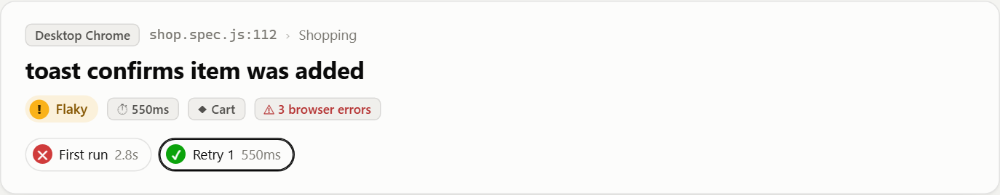

Click **First run** to see the failure and its screenshot; click **Retry 1** to see the passing version. Comparing the two is usually enough to spot a timing problem.

Scroll to **Stability**:

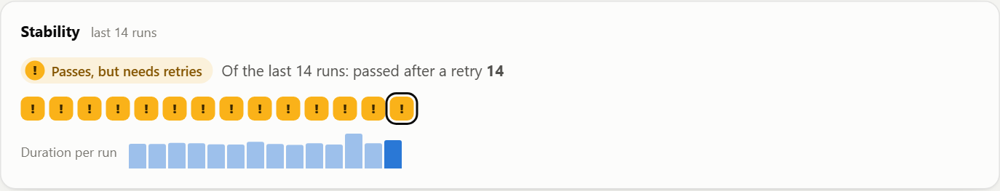

*Passes, but needs retries — of the last 14 runs: passed after a retry 14.* That's a test with a permanent timing problem, not a one-off hiccup. In the demo this is on purpose: the test waits too long before checking a message that disappears after 1.5 seconds.

> **Exercise 3.** Open the **First run** tab and read the error. Why did it fail?
>
> <details><summary>Answer</summary>"An element never appeared on the page — the test waited 500ms for getByText('Added to cart')…". The toast had already disappeared by the time the test looked for it. The fix is to check for the toast immediately, not after a wait.</details>

---

## Part 5 — A passing test that hides errors

Green doesn't always mean healthy. Open **payment widget loads without errors** — it passed, but its header carries a red **⚠ 4 browser errors** badge. Click it:

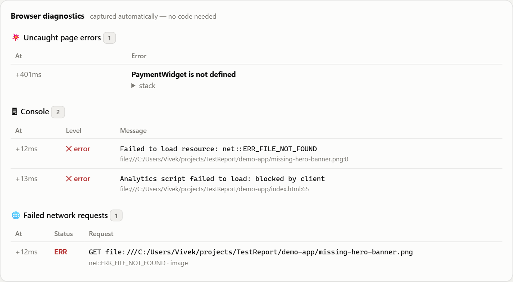

Aurora recorded, with no code in the test:

- **💥 Uncaught page errors** — `PaymentWidget is not defined`. A real JavaScript crash in the app that the test never checked for.
- **🖥 Console errors** — a failed analytics script.
- **🌐 Failed network requests** — a missing image, `net::ERR_FILE_NOT_FOUND`.

The test only checked that a button could be clicked, so it passed. The report shows the crash anyway.

> **Tip.** When someone says "but the tests are green", this panel is where you look.

---

## Part 6 — Watch the test instead of reading it

### The story

Every test has a **Test story**: each recorded step with a screenshot.

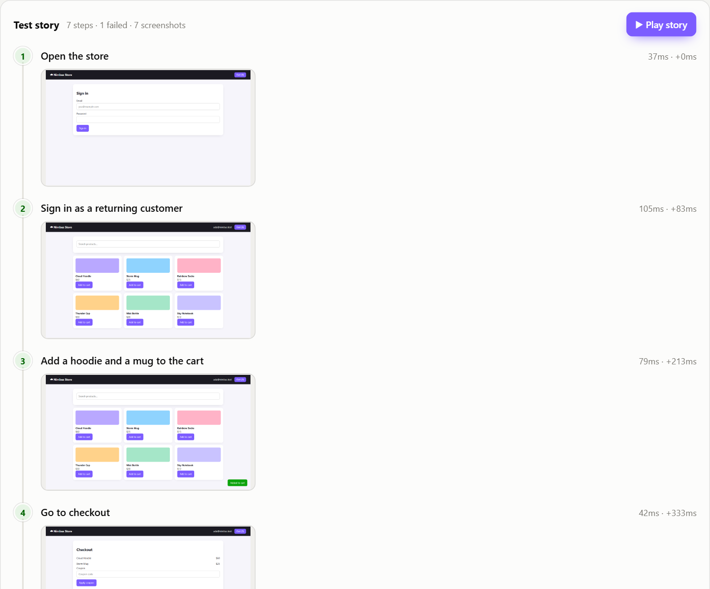

Read down the page and you see the customer signing in, adding items, opening checkout, and the step that failed — in pictures.

### Play story

Click **▶ Play story** for a full-screen slideshow of the test:

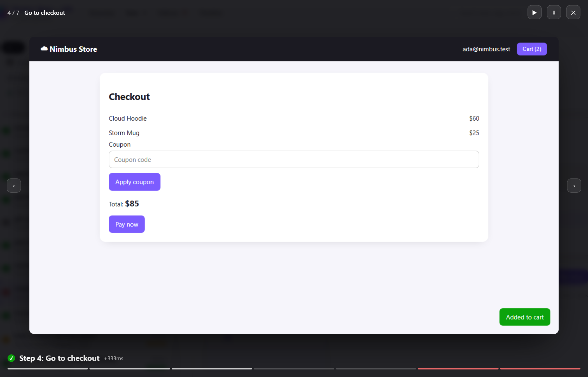

Use `←` `→` to move, `Space` to pause, `Esc` to close. Red marks on the progress bar are failed steps. This is the fastest way to show a non-technical colleague what the test does.

### Video, screenshots and trace

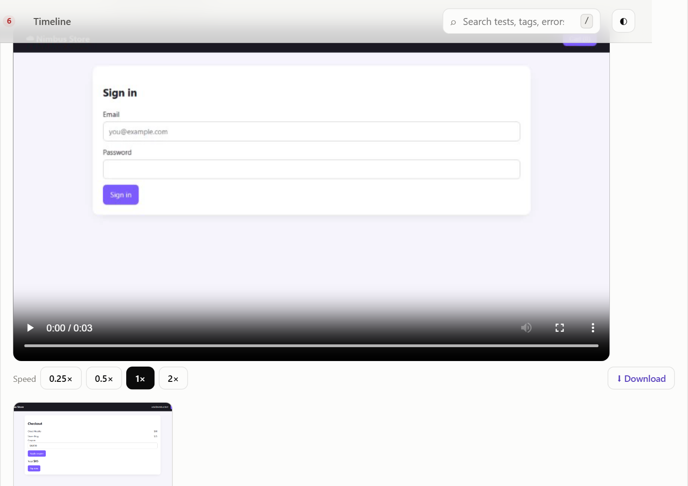

- **Video** of the run, with 0.25×–2× speed buttons. Slow it down to catch a flash of an error message.
- **Failure screenshot** and other screenshots.
- **Playwright trace** — copy the command to open Playwright's own step-by-step debugger with DOM snapshots and network details.

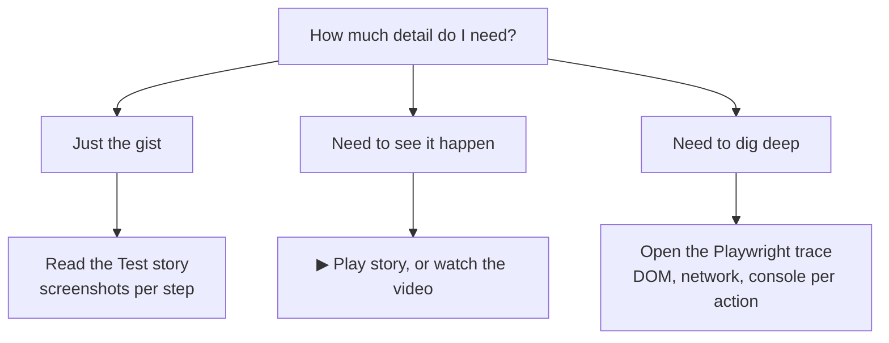
```mermaid
flowchart TD
    Q["How much detail do I need?"] --> A["Just the gist"]
    Q --> B["Need to see it happen"]
    Q --> C["Need to dig deep"]
    A --> A1["Read the Test story<br/>screenshots per step"]
    B --> B1["▶ Play story, or watch the video"]
    C --> C1["Open the Playwright trace<br/>DOM, network, console per action"]
```

---

## Part 7 — The timeline

Press `4`.

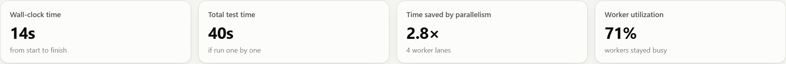

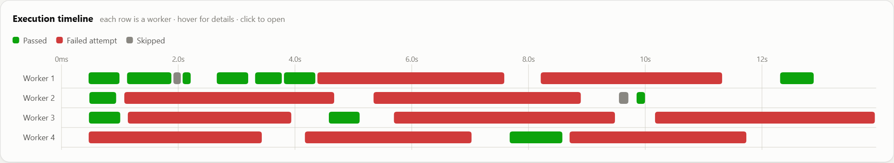

Each row is a worker — a parallel browser. Green is a passing test, red a failing attempt. Use this page to answer:

- **Why did the run take so long?** Look for one long bar holding everything up.
- **Am I using my machine well?** Low *worker utilization* means workers sat idle, often waiting on a shared resource.
- **Could I run more in parallel?** *Total test time* far above *wall-clock time* means parallelism is already helping.

---

## Part 8 — Make your own test tell a story

So far you've read a report. Now produce one. Each line of code maps to something you can see:

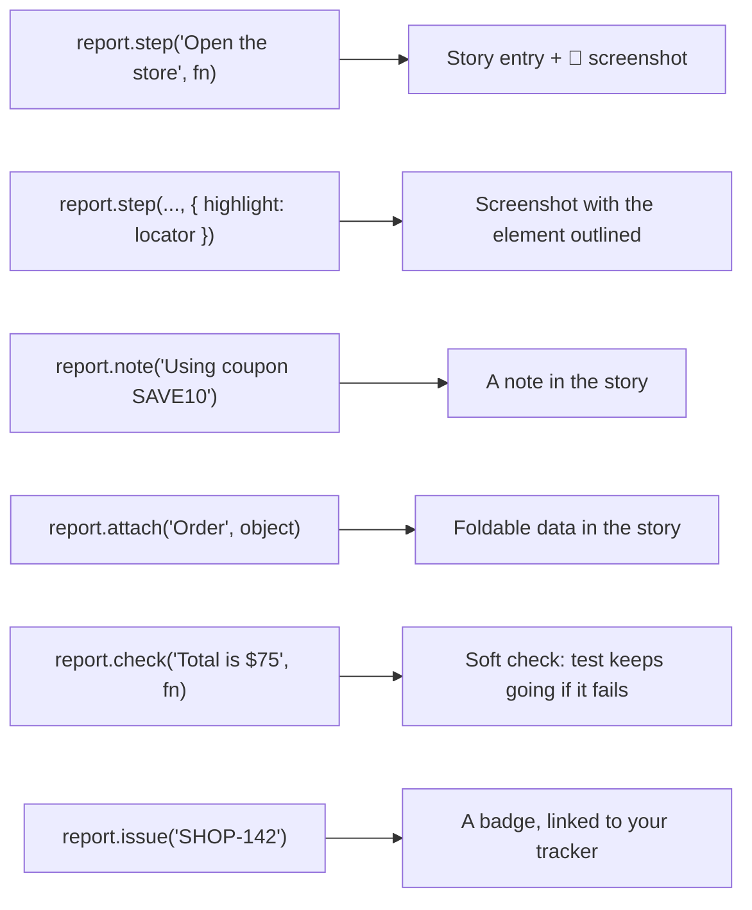
```mermaid
flowchart LR
    A["report.step('Open the store', fn)"] --> A1["Story entry + 📸 screenshot"]
    B["report.step(..., { highlight: locator })"] --> B1["Screenshot with the element outlined"]
    C["report.note('Using coupon SAVE10')"] --> C1["A note in the story"]
    D["report.attach('Order', object)"] --> D1["Foldable data in the story"]
    E["report.check('Total is $75', fn)"] --> E1["Soft check: test keeps going if it fails"]
    F["report.issue('SHOP-142')"] --> F1["A badge, linked to your tracker"]
```

Create `tests/my-first.spec.js`:

```js
const path = require('path');
const { pathToFileURL } = require('url');
const { test, expect } = require('../src');   // in your own project: require('aurora-report')

const APP = pathToFileURL(path.join(__dirname, '..', 'demo-app', 'index.html')).href;

test('my first story', async ({ page, report }) => {
  report.owner('Me');
  report.feature('Learning');

  await report.step('Open the store', async () => {
    await page.goto(APP);
  });

  await report.step('Sign in', async () => {
    await page.getByLabel('Email').fill('learner@example.com');
    await page.getByLabel('Password').fill('secret');
    await page.getByRole('button', { name: 'Sign in' }).click();
  });

  report.note('The catalogue should now show 6 products');

  await report.step('Six products are listed', async () => {
    await expect(page.getByTestId('product')).toHaveCount(6);
  }, { highlight: page.locator('#products') });   // outlines the product grid

  await report.attach('What I checked', { products: 6, user: 'learner@example.com' });
});
```

Run just this test and open the report:

```bash
npx playwright test tests/my-first.spec.js --project "Desktop Chrome"
npx aurora-report open
```

In the report you should see your test with a three-step story, a screenshot per step, your note between steps 2 and 3, the product grid outlined in pink in the last screenshot, and your attached data at the bottom.

> **Exercise 4.** Make your test fail on purpose — change `toHaveCount(6)` to `toHaveCount(7)` — and run it again. Which failure category does Aurora give it, and what does Expected vs Received say?
>
> <details><summary>Answer</summary>"A check did not match what the test expected", with Expected 7 and Received 6. The failure screenshot shows the six products, and the story marks the third step red.</details>

### Tips for stories worth reading

| Instead of | Write |
|---|---|
| `await report.step('click btn', ...)` | `await report.step('Customer submits the order', ...)` |
| One giant step for the whole test | One step per thing the user does |
| `report.step('check')` | `report.step('Cart badge shows 2 items')` |

Name each step after **what should be true afterwards**. Then the story reads like a description of the feature, and a failed step tells you what stopped being true.

---

## Part 9 — Use it on your own project

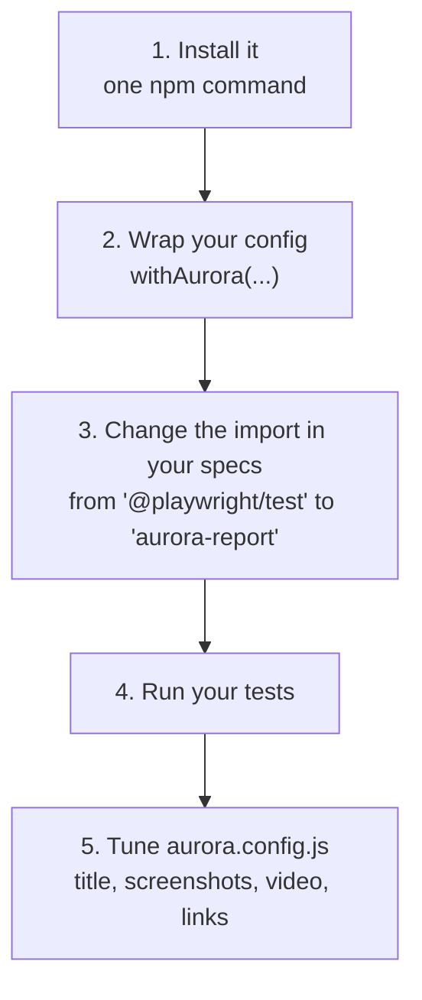
```mermaid
flowchart TD
    A["1. Install it<br/>one npm command"] --> B["2. Wrap your config<br/>withAurora(...)"]
    B --> C["3. Change the import in your specs<br/>from '@playwright/test' to 'aurora-report'"]
    C --> D["4. Run your tests"]
    D --> E["5. Tune aurora.config.js<br/>title, screenshots, video, links"]
```

### Step 1 — Install it

Aurora is **not on the public npm registry**, so `npm install aurora-report` on its own will not find it. Pick one of these three instead.

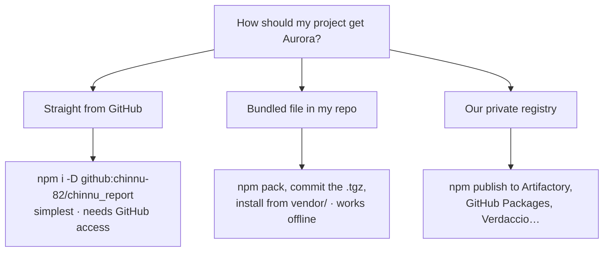
```mermaid
flowchart TD
    Q["How should my project get Aurora?"] --> A["Straight from GitHub"]
    Q --> B["Bundled file in my repo"]
    Q --> C["Our private registry"]
    A --> A1["npm i -D github:chinnu-82/chinnu_report<br/>simplest · needs GitHub access"]
    B --> B1["npm pack, commit the .tgz,<br/>install from vendor/ · works offline"]
    C --> C1["npm publish to Artifactory,<br/>GitHub Packages, Verdaccio…"]
```

**a) Straight from GitHub — the simplest**

```bash
npm install --save-dev @playwright/test github:chinnu-82/chinnu_report
```

It appears in `node_modules` as `aurora-report`. There is no build step. Pin it so upgrades are deliberate:

```bash
npm install --save-dev github:chinnu-82/chinnu_report#<commit-sha>
```

**b) A bundled file in your repo — no network needed**

Use this when CI has no access to GitHub, or you want the exact bytes pinned. In a checkout of the report repo:

```bash
npm pack          # produces aurora-report-1.1.0.tgz
```

Copy that file into your project (for example `vendor/`), commit it, and point `package.json` at it:

```json
"devDependencies": {
  "@playwright/test": "^1.63.0",
  "aurora-report": "file:vendor/aurora-report-1.1.0.tgz"
}
```

Then `npm install`. Anyone who clones your repo gets the reporter with no extra steps — this is what the [Shopify store example](https://github.com/chinnu-82/sample_code_withReport) does.

**c) Your own npm registry**

If your team runs Artifactory, GitHub Packages or Verdaccio, `npm publish` it there once and install it by name like any other package.

> **You need** Node 18 or newer, and `@playwright/test` 1.40 or newer, which stays your own dependency.

### Step 2 — Wrap your Playwright config

```js
// playwright.config.js
const { defineConfig } = require('@playwright/test');
const { withAurora } = require('aurora-report');

module.exports = withAurora(
  defineConfig({ testDir: './tests' }),
  { title: 'My App' },
);
```

Your existing reporters and `use` settings are kept.

### Step 3 — Change the import in your specs

```diff
- const { test, expect } = require('@playwright/test');
+ const { test, expect } = require('aurora-report');
```

Your tests appear in the report either way. The import change is what gives you the `report` fixture — steps, highlighted screenshots, soft checks — plus automatic capture of console errors, page crashes and failed requests.

### Step 4 — Run

```bash
npx playwright test
npx aurora-report open
```

### Step 5 — Tune it

Create `aurora.config.js` when you want to change the title, the accent colour, how much is captured, or where reports go:

```js
const { defineAuroraConfig } = require('aurora-report');

module.exports = defineAuroraConfig({
  title: 'My App — E2E',
  theme: { accent: '#1f8a70' },
  timestampedRuns: true,   // keep every run in its own dated folder
  capture: { stepScreenshots: 'on', video: 'retain-on-failure' },
});
```

Every step, with copy-paste examples for JavaScript, TypeScript and ES modules, is in **[GUIDE.md](GUIDE.md)**:

- [Install](GUIDE.md#1-install) · [Connect it to Playwright](GUIDE.md#2-connect-it-to-playwright) · [Update your tests](GUIDE.md#3-update-your-tests)
- [Recording steps](GUIDE.md#4-recording-steps) · [Screenshots](GUIDE.md#5-screenshots) · [Videos and traces](GUIDE.md#6-videos-and-traces)
- [Configuration](GUIDE.md#11-configuration) · [Running in CI](GUIDE.md#13-running-in-ci) · [Troubleshooting](GUIDE.md#16-troubleshooting)

### Keyboard shortcuts worth remembering

| Key | Does |
|---|---|
| `1` `2` `3` `4` | Overview · Tests · Failures · Timeline |
| `/` | Search |
| `j` / `k` | Next / previous test |
| `Esc` | Close a panel |

---

## Glossary

| Term | Meaning |
|---|---|
| **Spec file** | A file containing tests, e.g. `tests/shop.spec.js` |
| **Step** | One recorded action in a test, shown as one line of the story |
| **Locator** | How Playwright finds an element, e.g. `getByRole('button', { name: 'Sign in' })` |
| **Assertion / check** | A statement that must be true, e.g. `expect(total).toHaveText('$75')` |
| **Soft check** | A check that records a failure but lets the test carry on |
| **Retry** | Running a failed test again to see whether it passes |
| **Flaky** | Failed once, passed on a retry — unreliable rather than broken |
| **Worker** | One parallel browser running tests |
| **Trace** | Playwright's detailed recording, opened with `npx playwright show-trace` |
| **Project** | A named browser or device setup, e.g. Desktop Chrome or Mobile Chrome |

---

## What next?

- Run the demo a few more times. The **Results over time** chart and each test's **Stability** strip fill up with history.
- Break something in `demo-app/index.html` — rename the **Sign in** button — and watch how many tests fail, and how Aurora groups them under one cause.
- Add Aurora to a real project with [GUIDE.md](GUIDE.md).

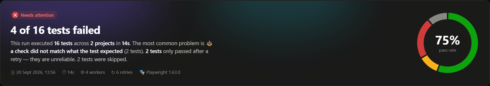

*Tip: the ◐ button in the top right switches between light and dark.*
